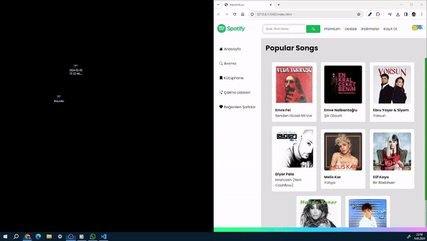

# Spotify Clone Website with REST API

Bu proje, Vanilla JavaScript, HTML5 ve SCSS becerilerini göstermek amacıyla geliştirilmiş bir Spotify klon websitesidir. Rest API protokolü kullanılarak Spotify'nin güncel hit popüler şarkılarından oluşan verileri alır ve dünya çapında milyonlarca şarkıyı içeren bir platform oluşturur.

## Özellikler

- **Güncel Popüler Şarkılar:** Spotify'nin API'sinden anlık olarak güncellenen popüler şarkılar listesini gösterir.
- **Geniş Veri Tabanı:** Dünya çapında milyonlarca şarkıyı kapsayan bir veri tabanına erişim sağlar.
- **Dinamik Arayüz:** Kullanıcı dostu bir arayüzle, şarkıları keşfetmek ve dinlemek kolaylaştırılmıştır.
- **Responsive Tasarım:** Farklı ekran boyutlarına uyumlu, mobil cihazlardan da erişilebilir.

## REST API Protokolü

Bu proje, Spotify'nin REST API'sini kullanarak veri alışverişi yapar. REST (Representational State Transfer), web tabanlı uygulamalar arasında veri iletişimi için yaygın olarak kullanılan bir protokoldür. Spotify'nin API'si, HTTP üzerinden yapılan isteklerle belirli bir URL'ye erişerek JSON formatında veri döndürür.

## Kullanılan Teknolojiler

- **Vanilla JavaScript:** Temel işlevsellik ve dinamik özellikler için kullanılmıştır.
- **HTML5:** Sayfa yapısını ve içeriğini oluşturmak için kullanılmıştır.
- **SCSS:** Daha düzenli ve yönetilebilir CSS kodları yazmak için kullanılmıştır.

